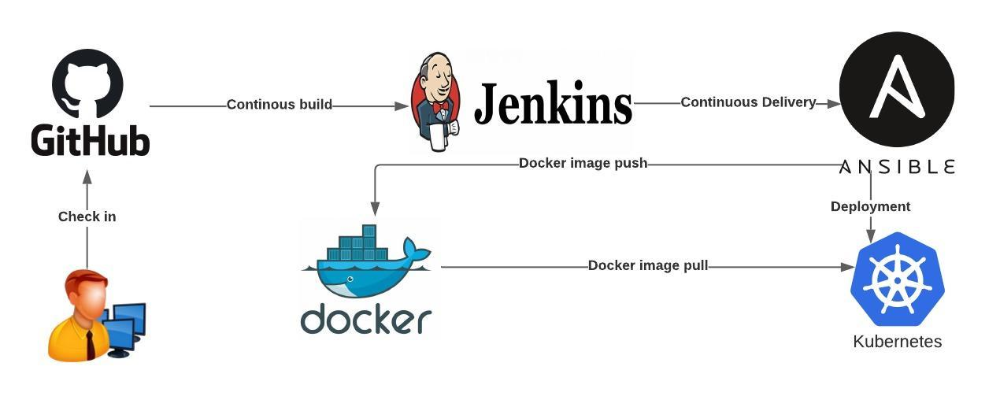

# DevOps CI/CD Pipeline
In this project we will build a CI/CD pipeline with Jenkins and Ansible to continuously integrate a REST API image and delivered it into the Docker Hub, then continuously deployed this application into the Kubernetes cluster ( Amazon Elastic Kubernetes Service (EKS))



##  Install Jenkins and Ansible on AWS EC2
Instructions on installing Jenkins on AWS EC2 can be found [here](https://github.com/yankils/Simple-DevOps-Project/blob/master/Jenkins/Jenkins_Installation.MD#install-jenkins-on-aws-ec2). 

Install ansible on the same instance.Instructions can be found [here](https://github.com/yankils/Simple-DevOps-Project/blob/master/Ansible/Ansible_installation.MD) .

Install git plugin on Jenkins.Instructions [here](https://github.com/yankils/Simple-DevOps-Project/blob/master/Jenkins/Git_plugin_install.MD)

## Install Docker on AWS EC2
Instructions on installing Docker on AWS EC2 can be found [here](https://github.com/yankils/Simple-DevOps-Project/blob/master/Docker/Docker_Installation_Steps.MD)


## Create Kubernetes (K8s) Cluster on AWS

1. Create Ubuntu EC2 instance
2. install AWSCLI 
```
curl https://s3.amazonaws.com/aws-cli/awscli-bundle.zip -o awscli-bundle.zip
 apt install unzip python
 unzip awscli-bundle.zip
 #sudo apt-get install unzip - if you dont have unzip in your system
 ./awscli-bundle/install -i /usr/local/aws -b /usr/local/bin/aws
```
3. Login to AWS
https://docs.aws.amazon.com/eks/latest/userguide/getting-started-console.html

``` 
# Access your "My Security Credentials" section in your profile. 
# Create an access key


# Regions
https://docs.aws.amazon.com/AmazonRDS/latest/UserGuide/Concepts.RegionsAndAvailabilityZones.html

```
4. Install kubectl on ubuntu instance
  ```
curl -LO https://storage.googleapis.com/kubernetes-release/release/$(curl -s https://storage.googleapis.com/kubernetes-release/release/stable.txt)/bin/linux/amd64/kubectl
 chmod +x ./kubectl
 sudo mv ./kubectl /usr/local/bin/kubectl
  ```
5.Deploy Cluster with EKS CLI  https://docs.aws.amazon.com/eks/latest/userguide/getting-started-eksctl.html

 ```
 # Install EKS CTL
curl --silent --location "https://github.com/weaveworks/eksctl/releases/latest/download/eksctl_$(uname -s)_amd64.tar.gz" | tar xz -C /tmp
mv /tmp/eksctl /usr/local/bin

```

```
eksctl create cluster --name getting-started-eks \
--region us-east-2 \
--version 1.16 \
--managed \
--node-type t2.small \
--nodes 1 \
--node-volume-size 200 
```

Cleanup
```
eksctl delete cluster --name getting-started-eks
```
## Define Jenkins Pipeline
- Clone this repo and change to directory
- Define Jenkins Pipeline in SCM.Instructions [here](https://www.jenkins.io/doc/book/pipeline/getting-started/#through-the-classic-ui)
- In the Jenkinsfile within the repo the **docker_prod_key** field needs to be defined as an SSH username and private key credential in Jenkins.
	` ansiblePlaybook credentialsId: 'docker_prod_key'` This would be the private key needed to SSH into  Docker server created in the "Install ansible" instructions above.
- In the Jenkinsfile within the repo the field **dockerhub** needs to be defined as as a Username with password credential in Jenkins `withDockerRegistry(credentialsId: 'dockerhub'` 
- In the Jenkinsfile within the repo the **k8s-managment-server-key** field needs to be defined as an SSH username and private key credential in Jenkins.
	` ansiblePlaybook credentialsId: 'k8s-managment-server-key',` This would be the private key needed to SSH into the k8s-managment-server-created in the "Create Kubernetes (K8s) Cluster on AWS" instructions above.

## Configure mail
To configure email notifications in jenkins please folllow guide [here](https://plugins.jenkins.io/mailer/).Mailer Plugin needed.Email address configured would be used in Jenkinsfile 	`mail bcc: '', body: 'Please  verify the build', cc: '', from: 'rooms21@gmail.com',`

SMTP settings can be obtaining from Amazon SES [here](https://aws.amazon.com/ses/)

## Webhooks
Confgure webhook in your repository. Example [here](https://docs.github.com/en/developers/webhooks-and-events/creating-webhooks)


## Finally
A git push should trigger the build.


You can send HTTP requests to your Flask server on publicip:5000, you can either use a REST client like Postman or Insomnia. You can also use cURL on the cli.

 
curl publicip:5000/home

curl -XPOST -H "Content-type: application/json" -d \ '{"name": "catty mcCatFace", "price": 5000, "breed": "bengal"}' \
'publicip:5000/add'

curl -XPATCH -H "Content-type: application/json" -d'{"name": "catty mcCatFace", "price": 9000, "breed": "bengal"}' ''publicip:5000/edit/1'

curl -X DELETE http://publicip:5000/remove/1

docker exec -it rest-api-docker-sqlalchemy_app_1 python -m pytest tests/
docker exec -it rest-api-docker-sqlalchemy_app_1 flake8 example
docker exec -it rest-api-docker-sqlalchemy_app_1 python -m pytest tests/ -p no:warnings --cov="example" --cov-report html
